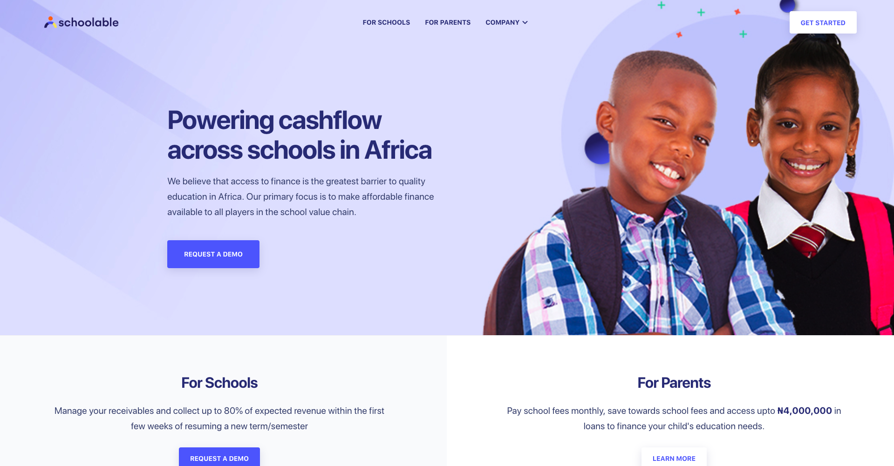

## Background

Schoolable is a company focused on the ideals of building and providing better educational financial instruments and opportunities, in order better service the African family, It's deals are to make the seemingly impossible possible and they have done a good job at making it real. Being a highly innovative company, they have come a long way and have even gone so far as becoming a YC funded enterprise, one of african's finest.

I worked with the company as its primary UI/UX expert building the best experience possible with the mobile and the webapp, under the directions of the team, most especially the CEO, **Henry Nnalue** and CTO **Akachukwu**, the process helped me gain more introspective ideas into building better experiences for user.

With respect to this case study, all ideas discoursed here are going to be subjective and open to criticism.

## It all starts with the Users.

Many tech businesse typically forget the role and contribution understanding your users brings, and its even easier to think, we already understand them, but nothing could be further from the truth. Because we really dont know shit. and its always best to assume, 

> you don't know shit. 🤷🏽‍♂️

Every project user focused should begin with the user and mind, and that's where we started. We proceeded to interview and about 50+ individuals with the prospects of having them test our app.
